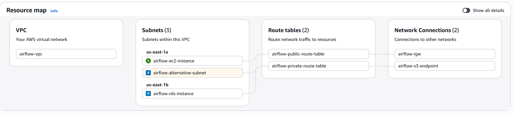

# 🌦️ Weather ETL Pipeline using Apache Airflow on AWS

An end-to-end **cloud-based ETL pipeline** built with **Apache Airflow** and deployed on **AWS**.  
This project demonstrates how to design, orchestrate, and operate a **production-like data pipeline** using real-world data engineering and cloud architecture best practices.

---

## 📌 Project Overview

The pipeline ingests weather data from an external API, applies transformation and enrichment logic, stores the data in a relational database, and exports analytics-ready datasets to cloud storage.

The primary objective of this project is to gain hands-on experience with **Apache Airflow**, **AWS services**, and secure cloud-based data pipelines, while focusing on scalability, security, and clean DAG design.

---

## 🏗️ Architecture Overview

### High-Level AWS Architecture

This diagram illustrates the overall system architecture, showing how Apache Airflow, Amazon RDS, and Amazon S3 interact within a custom AWS VPC.

---

## 🌐 VPC & Networking Architecture

This diagram represents the **AWS VPC resource map**, highlighting:
- Custom VPC configuration
- Public and private subnets across multiple Availability Zones
- Route tables for traffic management
- Internet Gateway for public access
- VPC Endpoint for secure S3 access from private resources

This setup ensures **network isolation**, **secure connectivity**, and adherence to cloud networking best practices.

---

## 🔄 Airflow DAG Overview

The DAG is organized using **Task Groups** to improve readability, modularity, and logical separation between pipeline stages.

---

## 🧩 Pipeline Workflow

### 1️⃣ Data Ingestion
- Checks Weather API availability using `HttpSensor`
- Extracts weather data using HTTP operators
- Shares data between tasks using **XCom**

### 2️⃣ Data Transformation
- Transforms raw JSON data using `PythonOperator` and **Pandas**
- Converts temperature units from **Kelvin → Fahrenheit**
- Adds time-based features:
  - Record timestamp  
  - Sunrise & sunset times
- Writes transformed data to CSV as an intermediate artifact

### 3️⃣ Data Loading
- Automatically creates PostgreSQL tables using SQL operators
- Loads transformed data using `PostgresHook` and `COPY`
- Imports city lookup data from S3 to RDS using  
  `aws_s3.table_import_from_s3`

### 4️⃣ Data Enrichment
- Performs SQL **JOINs** between weather data and city lookup tables
- Produces enriched, analytics-ready datasets

### 5️⃣ Data Export
- Exports final results to **Amazon S3**
- Uses **timestamp-based versioning** for historical tracking

---

## 🔐 Security & Best Practices
- No hard-coded credentials
- IAM Role for EC2 to allow secure S3 access
- IAM Role for RDS to support S3 imports
- Least Privilege access model
- Database isolated in a private subnet
- Secure routing using dedicated route tables and VPC endpoints

---

## 🚀 Tech Stack
- **Apache Airflow**
- **AWS EC2**
- **Amazon RDS (PostgreSQL)**
- **Amazon S3**
- **AWS VPC**
- **Python**
- **Pandas**
- **SQL**

---

## 🎯 Key Learnings
- Designing clean and maintainable **Airflow DAGs**
- Using **Task Groups** for pipeline organization
- Building secure **AWS VPC networking architectures**
- Working with Airflow Providers (HTTP, Postgres, AWS)
- Applying real-world **data engineering and cloud architecture patterns**

---

## 👤 Author
**Omar Salem**  
Aspiring Data Engineer | Cloud & Data Engineering Enthusiast
