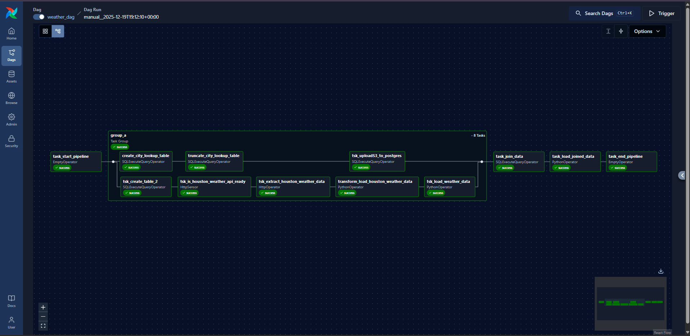

# 🌦️ Weather ETL Pipeline using Apache Airflow on AWS

An end-to-end **cloud-based ETL pipeline** built with **Apache Airflow** and deployed on **AWS**.  
This project demonstrates how to design, orchestrate, and operate a **production-like data pipeline** using real-world data engineering and cloud architecture best practices.

---

## 📌 Project Overview

The pipeline ingests weather data from an external API, applies transformation and enrichment logic, stores the data in a relational database, and exports analytics-ready datasets to cloud storage.

The primary objective of this project is to gain hands-on experience with **Apache Airflow**, **AWS services**, and secure cloud-based data pipelines, while focusing on scalability, security, and clean DAG design.

---

## 🏗️ Architecture Overview

### Infrastructure Components
- Apache Airflow running on an EC2 instance in a Public Subnet
- Amazon RDS (PostgreSQL) deployed in a Private Subnet
- Amazon S3 used as a Data Lake / Staging Layer
- Custom AWS VPC with isolated public and private subnets
- Secure networking via Security Groups
- Authentication and authorization using IAM Roles

---

## 🔄 Airflow DAG Overview

The DAG is organized using **Task Groups** to improve readability, modularity, and logical separation between pipeline stages.

---

## 🧩 Pipeline Workflow

### 1️⃣ Data Ingestion
- Uses `HttpSensor` to verify Weather API availability
- Extracts weather data using HTTP operators
- Shares data between tasks using XCom

### 2️⃣ Data Transformation
- Transforms raw JSON data using `PythonOperator` and Pandas
- Converts temperature units from Kelvin to Fahrenheit
- Adds time-based features (record time, sunrise, sunset)
- Exports transformed data to CSV as an intermediate artifact

### 3️⃣ Data Loading
- Creates PostgreSQL tables automatically using SQL operators
- Loads transformed data using `PostgresHook` and `COPY`
- Imports city lookup data from S3 to RDS using  
  `aws_s3.table_import_from_s3`

### 4️⃣ Data Enrichment
- Joins weather data with city lookup tables inside PostgreSQL
- Produces analytics-ready datasets

### 5️⃣ Data Export
- Exports final results to Amazon S3
- Uses timestamp-based versioning for historical tracking

---

## 🔐 Security & Best Practices
- No hard-coded credentials
- IAM Role for EC2 to access S3
- IAM Role for RDS to support S3 import
- Least Privilege access model
- Database isolated in a private subnet

---

## 🚀 Tech Stack
- Apache Airflow
- AWS EC2
- Amazon RDS (PostgreSQL)
- Amazon S3
- Python
- Pandas
- SQL

---

## 🎯 Key Learnings
- Designing clean and maintainable Airflow DAGs
- Using Task Groups for pipeline organization
- Working with Airflow Providers (HTTP, Postgres, AWS)
- Building secure and scalable cloud-based ETL pipelines
- Applying real-world data engineering architecture patterns

---

## 👤 Author
**Omar Salem**  
Aspiring Data Engineer | Cloud & Data Engineering Enthusiast
